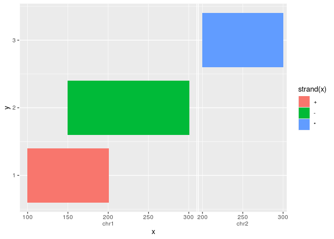

<!-- README.md is generated from README.Rmd. Please edit that file -->

# ggnomics 

<!-- badges: start -->

[](https://www.tidyverse.org/lifecycle/#experimental)
[](https://travis-ci.org/teunbrand/ggnomics)
[](https://codecov.io/gh/teunbrand/ggnomics)
<!-- badges: end -->

This packages offers tools to integrate Bioconductor S4 classes and the
ggplot2 plotting system.

## Installation

You can install this experimental branch from
[GitHub](https://github.com/) with:

``` r
# install.packages("devtools")
devtools::install_github("teunbrand/ggnomics")
```

## Example

The main idea is that you would be able to plot S4 Vector classes as you
would any other vector, without having to convert to base R or tidyverse
data-structures first. Below is an example of how the `GRanges` class
inside a `DataFrame` is handled.

``` r
suppressPackageStartupMessages({
  library(ggnomics)
  library(GenomicRanges)
})

df <- DataFrame(
  x = GRanges(c("chr1:100-200:+", "chr1:150-300:-", "chr2:200-300:*")),
  y = 1:3
)

g <- ggplot(df, aes(x, y, fill = strand(x))) +
  geom_tile(width = 0, height = 0.8)
g
```



## Explanation

To showcase what happens in the example above notice a few things. Most
noticeable is that the `GRanges` class is used as a valid position
variable. You can also notice the new axis guide, that appropriately
indicates the `seqnames` slot of the input.

Because `geom_tile()` re-parametrises the data as a rectangle with
`xmin` and `xmax` values, the `GRanges` object respectively uses it’s
start- and end-positions depending on the context of the aesthetic’s
name. This opens up a wide range of geoms to be compatible with ranged
classes.

The `aes(..., fill = strand(x))` statement uses ggplot2’s non-standard
evaluation as you would expect with `base::data.frame`s. Furthermore,
`strand(x)` evaluates to a `factor-Rle`, which is now a valid, mappable,
discrete class.

The data retains the S4 classes throughout the vast majority of plot
building, allowing specialised geoms and stats to take advantage of
this.

``` r
(ld <- layer_data(g))
#>      fill              x y PANEL group           xmin           xmax ymin ymax
#> 1 #F8766D chr1:100-200:+ 1     1    -1 chr1:100-200:+ chr1:100-200:+  0.6  1.4
#> 2 #00BA38 chr1:150-300:- 2     1    -1 chr1:150-300:- chr1:150-300:-  1.6  2.4
#> 3 #619CFF chr2:200-300:* 3     1    -1 chr2:200-300:* chr2:200-300:*  2.6  3.4
#>   colour size linetype alpha width height
#> 1     NA  0.1        1    NA     0    0.8
#> 2     NA  0.1        1    NA     0    0.8
#> 3     NA  0.1        1    NA     0    0.8
```

The trick here is that the S4 classes are protected from incompatible S3
`data.frame` operations, such as `rbind()`, by being wrapped in their
own `vctrs`-class. They still contain the beloved S4 classes though.

``` r
class(ld$x)
#> [1] "OakHorse"    "WoodenHorse" "vctrs_vctr"
class(Nightfall(ld$x))
#> [1] "GRanges"
#> attr(,"package")
#> [1] "GenomicRanges"
```

## Footnotes

This package is still very much a work in progress. Since the
Bioconductor ecosystem is rich with specialised infrastructure and
classes, I haven’t managed to try and test every class. However, most
things should work with `Rle`, `IRanges` and `GRanges` classes.

Furthermore, not all ggplot2 features lend themselves well to S4 vectors
yet: I’ve yet to devise a polar coordinate system and non-identity scale
transformations. Also not all position adjustments or layer stats are
expected to work perfectly.

I’d also like to mention that this is not the only genomics-oriented
ggplot package out there. Take a look at the
[ggbio](https://www.bioconductor.org/packages/release/bioc/html/ggbio.html)
package for instance. In my view, the main difference is that this
package is not going to produce your pretty plots for you, but by
extending ggplot2, this package allows the flexibility required to build
your own genomics plots.
